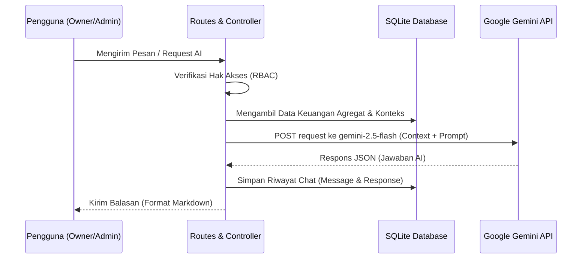

# Dokumentasi Modul Rooterin AI 2.0

Rooterin AI 2.0 adalah subsistem kecerdasan buatan tingkat lanjut yang diintegrasikan langsung ke dalam ekosistem **Rooterin Invoice**. Modul ini didesain khusus untuk membantu administrator dalam menganalisis data keuangan, menyusun draf komunikasi dengan klien, dan berinteraksi secara real-time mengenai ringkasan operasional billing.

---

## 🏗️ 1. Arsitektur AI & Alur Kerja

Integrasi AI di Rooterin mengabaikan penggunaan SDK wrapper pihak ketiga demi menjaga efisiensi memori, kontrol timeout yang presisi, dan portabilitas. Sistem berkomunikasi langsung dengan Google Gemini API menggunakan **Laravel HTTP Client (`Illuminate\Support\Facades\Http`)**.

### Alur Integrasi HTTP Direct Call


---

## 🔒 2. Keamanan & Kontrol Akses (RBAC)

Semua fungsionalitas kecerdasan buatan dikategorikan sebagai data sensitif tingkat tinggi (Financial Advisory & Strategy). Oleh karena itu, aturan hak akses berikut diberlakukan secara ketat:

### Matriks Akses Peran
| Fitur AI | Owner | Admin | Staff | Mekanisme Proteksi |
| :--- | :---: | :---: | :---: | :--- |
| **Halaman `/ai-assistant`** | ✅ | ✅ | ❌ | Middleware Rute `role:owner,admin` |
| **API `/ai-assistant/chat`** | ✅ | ✅ | ❌ | Middleware Rute & Method Check `hasFullAccess()` |
| **AI Email Draft (`/ai-email-draft`)** | ✅ | ✅ | ❌ | Middleware Rute & Method Check `hasFullAccess()` |
| **AI Financial Insights (Dashboard)** | ✅ | ✅ | ❌ | Penapisan Variabel di Controller (`$isStaff` Check) |
| **Widget Melayang Dashboard** | ✅ | ✅ | ❌ | Blade Guard `@if(auth()->user()->hasFullAccess())` |

### Implementasi Pengaman Kode
Pada awal pemrosesan controller, ditambahkan pengecekan gerbang utama:
```php
abort_if(!auth()->user()->hasFullAccess(), 403, 'Unauthorized action.');
```

---

## 🗄️ 3. Skema Database Riwayat Chat

Tabel `ai_chat_histories` digunakan untuk menyimpan log percakapan secara persisten, memungkinkan pengguna memulihkan riwayat chat dan beralih di antara sesi chat yang berbeda.

### Struktur Tabel `ai_chat_histories`
```sql
CREATE TABLE ai_chat_histories (
    id INTEGER PRIMARY KEY AUTOINCREMENT,
    user_id INTEGER NOT NULL,
    session_id VARCHAR(255) NOT NULL, -- UUID unik per sesi percakapan
    message TEXT NOT NULL,             -- Pesan masukan dari user
    response TEXT NOT NULL,            -- Balasan dari model Gemini AI
    created_at TIMESTAMP,
    updated_at TIMESTAMP,
    FOREIGN KEY(user_id) REFERENCES users(id) ON DELETE CASCADE
);
```

### Klasifikasi Riwayat Berdasarkan Rentang Waktu
Untuk mempermudah penjelajahan di sidebar, sesi chat dikelompokkan secara dinamis menggunakan kueri SQL berbasis timestamp:
- **Hari Ini (Today)**: Chat dalam waktu $< 24$ jam terakhir.
- **Kemarin (Yesterday)**: Chat antara $24$ hingga $48$ jam terakhir.
- **Minggu Ini (This Week)**: Chat antara $2$ hingga $7$ hari terakhir.
- **Bulan Ini (This Month)**: Chat antara $8$ hingga $30$ hari terakhir.
- **Lebih Lama (Older)**: Chat $> 30$ hari terakhir.

---

## 🤖 4. Integrasi Model `gemini-2.5-flash`

Sistem menggunakan model terbaru **`gemini-2.5-flash`** melalui REST API resmi.

### Konfigurasi Endpoint
- **URL**: `https://generativelanguage.googleapis.com/v1beta/models/gemini-2.5-flash:generateContent?key={API_KEY}`
- **Method**: `POST`
- **Headers**:
  ```http
  Content-Type: application/json
  ```

### Contoh Kode Pemanggilan HTTP Client di Laravel
Berikut adalah implementasi asli dari `AiChatController` yang memperlihatkan konstruksi muatan payload JSON ke API Gemini:

```php
$apiKey = env('GEMINI_API_KEY') ?: config('gemini.api_key');
if (empty($apiKey)) {
    throw new \Exception("GEMINI_API_KEY tidak dikonfigurasi di file .env");
}

$response = \Illuminate\Support\Facades\Http::withHeaders([
    'Content-Type' => 'application/json',
])->post('https://generativelanguage.googleapis.com/v1beta/models/gemini-2.5-flash:generateContent?key=' . $apiKey, [
    'contents' => [
        [
            'parts' => [
                ['text' => $prompt]
            ]
        ]
    ],
    'generationConfig' => [
        'temperature' => 0.7,
        'topK' => 40,
        'topP' => 0.95,
        'maxOutputTokens' => 2048,
    ]
]);

if ($response->successful()) {
    $result = $response->json();
    $reply = $result['candidates'][0]['content']['parts'][0]['text'] ?? 'Maaf, gagal memproses respons.';
} else {
    throw new \Exception("Gagal menghubungi server AI: " . $response->body());
}
```

---

## 🎯 5. Fitur Unggulan Interaktif

### A. Sistem Navigasi Otomatis (Auto-Navigation Tag)
Asisten AI dibekali kemampuan untuk menyarankan navigasi langsung ke halaman tertentu. Jika AI menyertakan tag khusus di akhir balasannya (misal: `[NAVIGATE: invoices.create]`), JavaScript frontend di `/ai-assistant` dan widget dashboard akan menangkap tag tersebut menggunakan regex dan merendernya sebagai tombol aksi visual (misalnya, *👉 Buat Invoice Baru*).

### B. New Chat & Reset Session
Pengguna dapat memulai percakapan baru dengan mengeklik tombol **New Chat** di sidebar. Aksi ini memicu regenerasi UUID baru di sisi client tanpa menghapus riwayat percakapan lama di database, sehingga riwayat sesi lama tetap aman diakses kapan saja.

### C. Draf Surel Cepat (AI Copywriter)
Fitur draf surel di halaman detail invoice menganalisis status invoice (apakah *Lunas*, *Pending*, atau *Menunggak*) dan menyusun draf surel penagihan kooperatif maupun apresiasi pelunasan secara instan dengan nada profesional.
