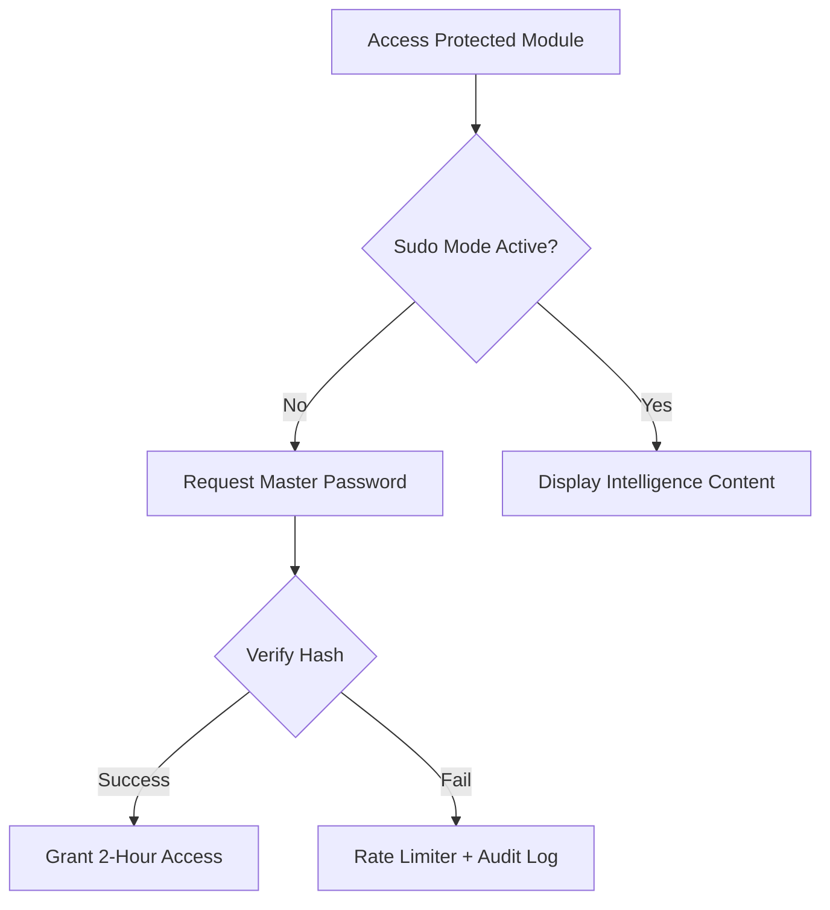
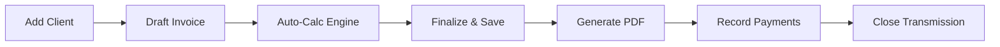

# J&J Group Invoice — Modern Enterprise Billing Ecosystem

<p align="center">
  
</p>

<p align="center">
  
  
  
  
</p>

> [!IMPORTANT]
> **Executive Summary**: J&J Group Invoice is a high-fidelity SaaS-level billing solution designed for enterprises that demand precision, security, and world-class aesthetics. It bridges the gap between complex financial operations and seamless user experience through real-time state management and high-level cryptographic protections.

---

## 📑 Table of Contents
1. [🚀 Core Intelligence Modules](#-core-intelligence-modules)
2. [🏗️ Technical Architecture](#️-technical-architecture)
3. [🎨 UI/UX Philosophy & Design System](#-uiux-philosophy--design-system)
4. [📡 System Workflows](#-system-workflows)
5. [🗄️ Database Schema Insights](#️-database-schema-insights)
6. [⚙️ Installation & Deployment](#️-installation--deployment)
7. [🗺️ Central Documentation Structure](#️-central-documentation-structure)

---

## 🚀 Core Intelligence Modules

### 🛡️ Security Command Center (Access Guard)
The system's "Black Box" that manages high-level security protocols.
*   **TOTP MFA Integration**: Hardened account protection via Google Authenticator or Authy.
*   **Sudo-Mode Protection**: Critical areas (Settings/Security) require re-verification with session-based persistence and rate limiting.
*   **Active Session Telemetry**: Real-time monitoring of all active transmissions with dynamic Browser/OS iconography and IP intelligence.
*   **Immutable Audit Trail**: Forensic logging of every sensitive operational trigger.

### 📄 Intelligent Invoicing Engine
Precision billing with a focus on automation.
*   **Auto-Calc Math Engine**: Real-time calculation of sub-totals, PPN/PPh, and final settlements as the user types.
*   **Multi-Stage Collections**: Advanced tracking of deposits (DP), partial payments, and liquidations.
*   **Pro PDF Generation**: Server-side rendering of enterprise-grade PDF documents for official distribution.

### 👥 Global Client Registry
Centralized entity intelligence for cross-module consistency.
*   **NPWP & Tax Profiling**: Storage and validation of tax credentials for B2B compliance.
*   **Relational History**: Instant access to every transaction, quotation, and payment associated with an entity.

### 🧠 Kecerdasan Buatan (AI Intelligence Hub)
Orkestrasi modul kecerdasan buatan tingkat lanjut yang didukung oleh model bahasa besar Google Gemini untuk optimalisasi operasional bisnis.
*   **AI Financial Insights**: Analisis otomatis data keuangan secara real-time yang menghasilkan saran taktis arus kas dan penagihan strategis langsung di Dashboard Owner/Admin.
*   **AI Chatbot Assistant**: Asisten virtual interaktif halaman penuh (`/ai-assistant`) dan widget mengambang di dashboard dengan riwayat chat persisten, pengelompokan sesi berbasis waktu, dan pemahaman kontekstual data tagihan aktif.
*   **AI Copywriter (Draf Surel)**: Pembuatan draf email korespondensi invoice otomatis yang disesuaikan dengan status penagihan untuk mempercepat komunikasi dengan klien.

---

## 🏗️ Technical Architecture

### 🛠️ The Power Stack
| Layer | Technology | Rationale |
| :--- | :--- | :--- |
| **Backend** | Laravel 11.x | Enterprise-grade routing, ORM, and dependency injection. |
| **Frontend** | Livewire 3.x (Class-based) | Reactive state management without the complexity of a separate SPA. |
| **Logic** | Alpine.js 3.x | Lightweight client-side reactivity for UI micro-interactions. |
| **Styling** | Vanilla CSS & Tailwind CSS | Utility-first design for pixel-perfect, maintainable layouts. |

### 🔒 Hardened Security Layers
*   **Encryption**: AES-256-CBC encryption for sensitive 2FA secrets and recovery codes.
*   **Hashing**: Argon2id password hashing as the standard for high-security environments.
*   **Gatekeeping**: Custom Middlewares and Sudo-Mode controllers for tiered access control.
*   **Polling**: Lightweight async polling for real-time notification and session updates.

---

## 🎨 UI/UX Philosophy & Design System

J&J Group Invoice follows the **Elite Intelligence** design language:
*   **Glassmorphism Engine**: Utilizing backdrop-blur and translucent cards to create depth and hierarchy.
*   **Bento-Grid Layouts**: Organizing feature intelligence into compact, modular cards for rapid scanning.
*   **Micro-animations**: Subtle hover effects, scale transitions, and pulse animations for interactive feedback.
*   **Dynamic Scaling**: A fluid grid system that ensures professional presentation on smartphones, tablets, and desktops.

---

## 📡 System Workflows

### 🛡️ Security Verification Flow


### 📄 Invoicing Operational Cycle


---

## 🗄️ Database Schema Insights

The data architecture is designed for high relational integrity:
*   **Users**: The primary identity layer, storing encrypted security secrets and profile metadata.
*   **Clients**: The secondary entity layer, linked to multiple receipts and invoices.
*   **Invoices (Receipts)**: The core transaction layer, featuring relational line-items and payment tracking.
*   **Security Logs**: The forensic layer, storing IP, User-Agent, and activity telemetry.
*   **Sessions**: The database-driven session layer for real-time device management.

---

## ⚙️ Installation & Deployment

### 📋 Prerequisites
*   **PHP**: 8.2 or higher
*   **Web Server**: Apache (Laragon), Nginx, or Laravel Octane
*   **Database**: MySQL / MariaDB (production) or SQLite (testing)
*   **Node.js**: 20+ (for asset compilation)

### 🚀 Quick Deployment
1.  **Clone the Repository**:
    ```bash
    git clone https://github.com/rafaelabimanyu/Rooterin-Invoice.git
    cd Rooterin-Invoice
    ```
2.  **Install Dependencies**:
    ```bash
    composer install
    npm install
    ```
3.  **Configure Environment**:
    ```bash
    cp .env.example .env
    php artisan key:generate
    ```
4.  **Database Initialization**:
    ```bash
    # IMPORTANT: Ensure SESSION_DRIVER=database in .env
    php artisan migrate --seed
    ```
5.  **Compile & Run**:
    ```bash
    npm run dev
    php artisan serve
    ```

---

## 🗺️ Central Documentation Structure

Semua detail sistem didokumentasikan secara terstruktur di folder [/docs](file:///c:/laragon/www/Rooterin-Invoice/docs):

1.  **Arsitektur & Skema**:
    *   [Architecture Strategy](file:///c:/laragon/www/Rooterin-Invoice/docs/architecture_strategy.md) — Filosofi desain sistem dan alur kerja utama.
    *   [Technical Schema](file:///c:/laragon/www/Rooterin-Invoice/docs/technical_schema.md) — Kamus data dan ERD Logic database.
2.  **Panduan Peran (Roles)**:
    *   [System Owner Guide](file:///c:/laragon/www/Rooterin-Invoice/docs/roles/owner.md) — Otoritas KPI, keamanan, dan user.
    *   [System Admin Guide](file:///c:/laragon/www/Rooterin-Invoice/docs/roles/admin.md) — Kontrol operasional dan data klien.
    *   [Staff Operational Guide](file:///c:/laragon/www/Rooterin-Invoice/docs/roles/staff.md) — Pembuatan tagihan dan kwitansi.
3.  **Modul & Halaman**:
    *   [Transaction Ledger](file:///c:/laragon/www/Rooterin-Invoice/docs/halaman/ledger.md) — Penjelasan jembatan jurnal transaksi read-only.
    *   [Chronos Calendar](file:///c:/laragon/www/Rooterin-Invoice/docs/halaman/chronos_calendar.md) — Penjadwalan interaktif jatuh tempo tagihan.
    *   [Trash Management](file:///c:/laragon/www/Rooterin-Invoice/docs/halaman/trash_management.md) — Mekanisme soft delete, restore, dan purge data.
4.  **Fitur Cerdas & Teknis**:
    *   [AI Chatbot Assistant](file:///c:/laragon/www/Rooterin-Invoice/docs/fitur/ai_assistant.md) — Riwayat sesi asisten finansial Gemini.
    *   [AI Voice Commands](file:///c:/laragon/www/Rooterin-Invoice/docs/fitur/ai_voice_commands.md) — Penjelajahan berbasis suara dan perutean aksi.
    *   [Backup System](file:///c:/laragon/www/Rooterin-Invoice/docs/fitur/backup_system.md) — Pengarsipan berkala database & attachment.
5.  **Aturan Bisnis & Keamanan**:
    *   [Financial Calculations](file:///c:/laragon/www/Rooterin-Invoice/docs/kalkulasi/financial_calculations.md) — Rumus pembagian keuntungan (profit sharing) dan total tagihan.
    *   [Security Protocols](file:///c:/laragon/www/Rooterin-Invoice/docs/keamanan/security_protocols.md) — Penjelasan TOTP 2FA, Sudo Mode, dan telemetri sesi.
6.  **SOP & Panduan Pengguna**:
    *   [User & SOP Guide](file:///c:/laragon/www/Rooterin-Invoice/docs/user_guide.md) — SOP penerbitan invoice & alur kwitansi.

---
**J&J Group Enterprise Billing System**
*   **Support**: [Jayarooter@gmail.com](mailto:Jayarooter@gmail.com)
*   **Project Lead**: Rafael Abimanyu / Antigravity AI
*   **GitHub**: [rafaelabimanyu/Rooterin-Invoice](https://github.com/rafaelabimanyu/Rooterin-Invoice)
