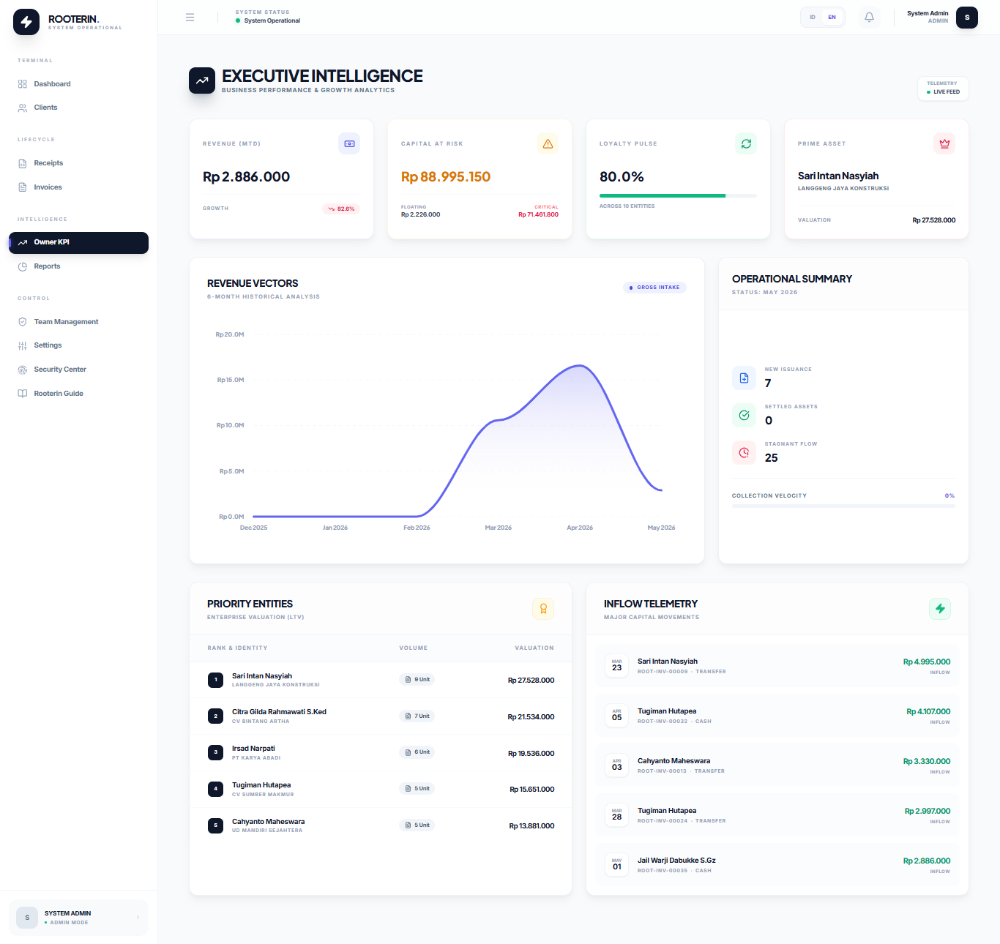
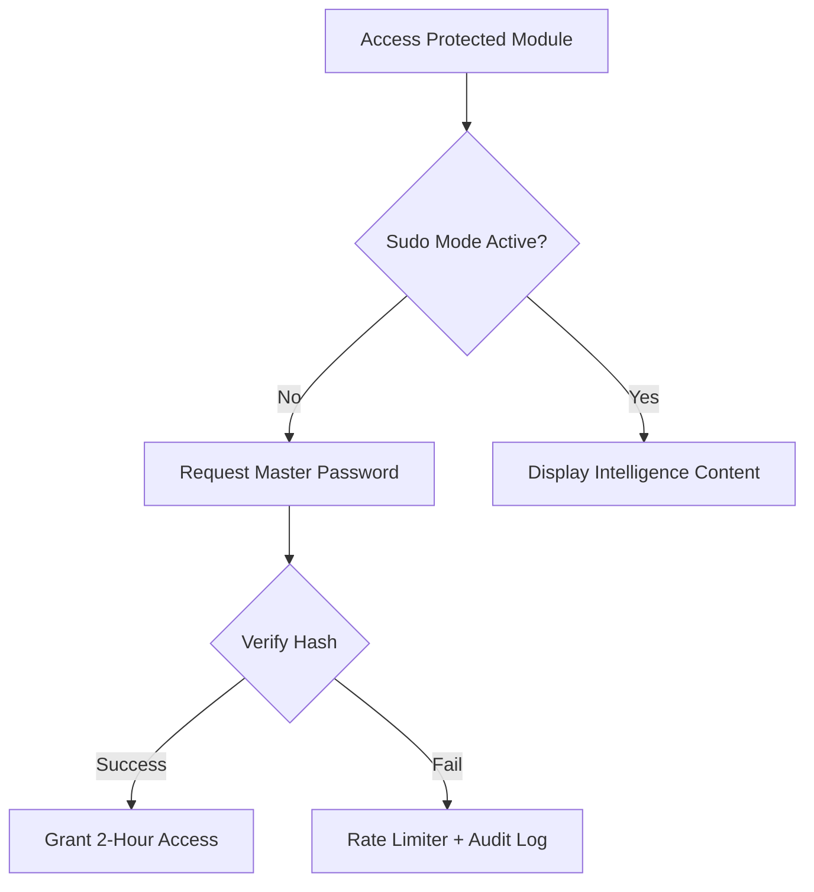
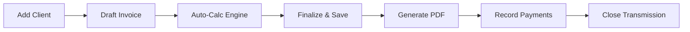

# Rooterin Invoice — Modern Enterprise Billing Ecosystem

<p align="center">
  
</p>

<p align="center">
  
  
  
  
</p>

> [!IMPORTANT]
> **Executive Summary**: Rooterin is a high-fidelity SaaS-level billing solution designed for enterprises that demand precision, security, and world-class aesthetics. It bridges the gap between complex financial operations and seamless user experience through real-time state management and high-level cryptographic protections.

---

## 📑 Table of Contents
1. [🚀 Core Intelligence Modules](#-core-intelligence-modules)
2. [🏗️ Technical Architecture](#️-technical-architecture)
3. [🎨 UI/UX Philosophy & Design System](#-uiux-philosophy--design-system)
4. [📡 System Workflows](#-system-workflows)
5. [🗄️ Database Schema Insights](#️-database-schema-insights)
6. [⚙️ Installation & Deployment](#️-installation--deployment)
7. [🗺️ Development Roadmap](#️-development-roadmap)

---

## 🚀 Core Intelligence Modules

### 🛡️ Security Command Center (Access Guard)
The system's "Black Box" that manages high-level security protocols.
*   **TOTP MFA Integration**: Hardened account protection via Google Authenticator or Authy.
*   **Sudo-Mode Protection**: Critical areas (Settings/Security) require re-verification with session-based persistence and rate limiting.
*   **Active Session Telemetry**: Real-time monitoring of all active transmissions with dynamic Browser/OS iconography and IP intelligence.
*   **Immutable Audit Trail**: Forensic logging of every sensitive operational trigger.

### 📄 Intelligent Invoicing Engine
Precision billing with a focus on automation.
*   **Auto-Calc Math Engine**: Real-time calculation of sub-totals, PPN (VAT), and final settlements as the user types.
*   **Multi-Stage Collections**: Advanced tracking of deposits (DP), partial payments, and liquidations.
*   **Pro PDF Generation**: Server-side rendering of enterprise-grade PDF documents for official distribution.

### 👥 Global Client Registry
Centralized entity intelligence for cross-module consistency.
*   **NPWP & Tax Profiling**: Storage and validation of tax credentials for B2B compliance.
*   **Relational History**: Instant access to every transaction, quotation, and payment associated with an entity.

### 🧠 Kecerdasan Buatan (AI Intelligence Hub)
Orkestrasi modul kecerdasan buatan tingkat lanjut yang didukung oleh model bahasa besar Google Gemini untuk optimalisasi operasional bisnis.
*   **AI Financial Insights**: Analisis otomatis data keuangan secara real-time yang menghasilkan saran taktis arus kas dan penagihan strategis langsung di Dashboard Owner/Admin.
*   **AI Chatbot Assistant**: Asisten virtual interaktif halaman penuh (`/ai-assistant`) dan widget mengambang di dashboard dengan riwayat chat persisten, pengelompokan sesi berbasis waktu, dan pemahaman kontekstual data tagihan aktif.
*   **AI Copywriter (Draf Surel)**: Pembuatan draf email korespondensi invoice otomatis yang disesuaikan dengan status penagihan untuk mempercepat komunikasi dengan klien.

---

## 🏗️ Technical Architecture

### 🛠️ The Power Stack
| Layer | Technology | Rationale |
| :--- | :--- | :--- |
| **Backend** | Laravel 13.x | Enterprise-grade routing, ORM, and dependency injection. |
| **Frontend** | Livewire 4.x (Class-based) | Reactive state management without the complexity of a separate SPA. |
| **Logic** | Alpine.js 3.15 | Lightweight client-side reactivity for UI micro-interactions. |
| **Styling** | Tailwind CSS 3.4 | Utility-first design for pixel-perfect, maintainable layouts. |

### 🔒 Hardened Security Layers
*   **Encryption**: AES-256-CBC encryption for sensitive 2FA secrets and recovery codes.
*   **Hashing**: Argon2id password hashing as the standard for high-security environments.
*   **Gatekeeping**: Custom Middlewares and Sudo-Mode controllers for tiered access control.
*   **Polling**: Lightweight async polling for real-time notification and session updates.

---

## 🎨 UI/UX Philosophy & Design System

Rooterin follows the **Elite Intelligence** design language:
*   **Glassmorphism Engine**: Utilizing backdrop-blur and translucent cards to create depth and hierarchy.
*   **Bento-Grid Layouts**: Organizing feature intelligence into compact, modular cards for rapid scanning.
*   **Micro-animations**: Subtle hover effects, scale transitions, and pulse animations for interactive feedback.
*   **Dynamic Scaling**: A fluid grid system that ensures professional presentation on smartphones, tablets, and desktops.

---

## 📡 System Workflows

### 🛡️ Security Verification Flow


### 📄 Invoicing Operational Cycle


---

## 🗄️ Database Schema Insights

The data architecture is designed for high relational integrity:
*   **Users**: The primary identity layer, storing encrypted security secrets and profile metadata.
*   **Clients**: The secondary entity layer, linked to multiple receipts and invoices.
*   **Receipts (Invoices)**: The core transaction layer, featuring relational line-items and payment tracking.
*   **Security Logs**: The forensic layer, storing IP, User-Agent, and activity telemetry.
*   **Sessions**: The database-driven session layer for real-time device management.

---

## ⚙️ Installation & Deployment

### 📋 Prerequisites
*   **PHP**: 8.3 or higher (required for latest Laravel features)
*   **Web Server**: Nginx, Apache, or Laravel Octane
*   **Database**: SQLite (default), MySQL, or PostgreSQL
*   **Node.js**: 20+ (for asset compilation)

### 🚀 Quick Deployment
1.  **Clone the Repository**:
    ```bash
    git clone https://github.com/rafaelabimanyu/Rooterin-Invoice.git
    cd Rooterin-Invoice
    ```
2.  **Install Dependencies**:
    ```bash
    composer install
    npm install
    ```
3.  **Configure Environment**:
    ```bash
    cp .env.example .env
    php artisan key:generate
    ```
4.  **Database Initialization**:
    ```bash
    # IMPORTANT: Ensure SESSION_DRIVER=database in .env
    php artisan migrate --seed
    ```
5.  **Compile & Run**:
    ```bash
    npm run build
    php artisan serve
    ```

---

## 🗺️ Development Roadmap

- [ ] **AI-Powered Analytics**: Predictive revenue forecasting based on historical data.
- [ ] **Multi-Currency Support**: Automated exchange rate integration for global billing.
- [ ] **API Gateway**: RESTful endpoints for third-party ERP integrations.
- [ ] **Client Portal**: Dedicated secure area for clients to view and pay invoices.

---

**Rooterin Enterprise Billing System**
*   **Support**: [rooterinofficial@gmail.com](mailto:rooterinofficial@gmail.com)
*   **Project Lead**: Rafael Abimanyu / Antigravity AI
*   **GitHub**: [rafaelabimanyu/Rooterin-Invoice](https://github.com/rafaelabimanyu/Rooterin-Invoice)

---
*Created with the precision of advanced agentic coding for modern business operations.*
